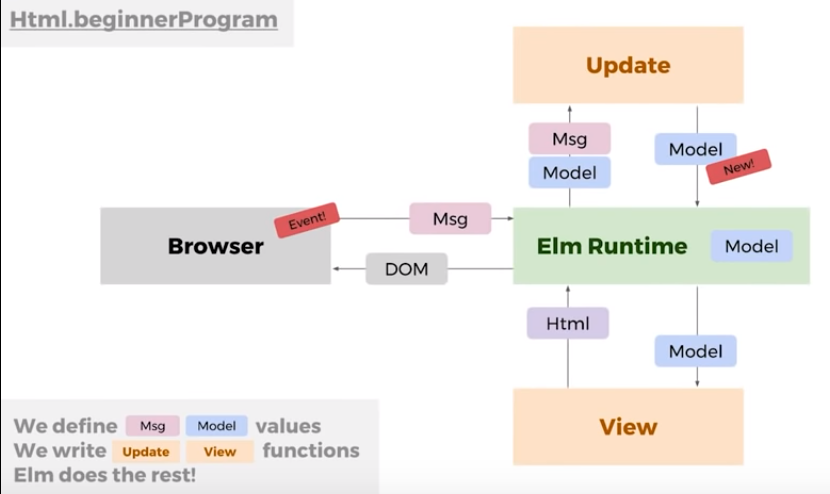

# Learning elm language from zero

Resources: https://www.youtube.com/watch?v=kEitFAY7Gc8

## Intro

In Javascript, you have a lot of library or things to install and use, like npm, webpack, react, redux, flow, immutable.js.
But in elm, everything above are included in the language architecture itself (not a built in library, but the language itself).

## Basic Demo - simple counter web app

Make a file named `app.elm` or any name, then write codes like below.

```elm
module Main exposing (..)
-- 2 dots mean we expose everything in the main module

import Html exposing (beginnerProgram, button, div, text)
-- we import Html library and exposes those functions listed in the bracket.

import Html.Events exposing (onClick)
-- use onclick function

initModel = 0
--the initial value of the counter, lke state in react.

type Msg = Increment | Decrement
--list of actions/manipulation like we use in redux.


update msg model =
    case msg of
        Increment ->
            model + 1

    case msg of
        Decrement ->
            model - 1
-- this is where you handle the data manipulation of the actions listed before

view model =
    div []
        [
        button [onClick Increment][text "+"]
        , div []
            [text(toString model)]
        , button [onClick Decrement][text "-"]
        ]
-- this is the part that will be view, like render in react.

main = beginnerProgram {model = initModel, view = view, update = update}
-- here, elm always look at 3 things, the model(state), view(view in html), and update(get message, change, and give the model back) function.
```

Read the comments in the code to understand more.
How the whole interaction works? See image below.

When there is a new event in the browser like the user click the '+' button which stated as `Increment` in our `msg`, the browser gives us a Msg type to the Elm Runtime. Then, it will use the update function and it will give a new model back. The Elm Runtime will pass the new model to the View function to get the html. Then it will do the DOM thingy to differentiate and update what changes in the browser.

---

Resources: https://elmprogramming.com

```elm
module HomePage exposing (main)

import Html exposing (..)
import Html.Attributes exposing (..)


view model =
    div [ class "jumbotron" ]
        [ h1 [] [ text "Welcome to Dunder Mifflin!" ]
        , p []
            [ text "Dunder Mifflin Inc. (stock symbol "
            , strong [] [ text "DMI" ]
            , text <|
                """
                ) is a micro-cap regional paper and office
                supply distributor with an emphasis on servicing
                small-business clients.
                """
            ]
        ]


main =
    view "dummy model"
```
